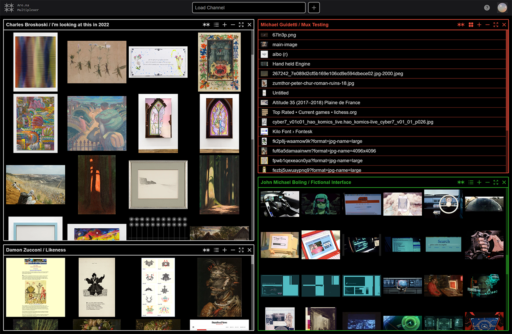

# Are.na Multiplexer

Are.na Multiplexer is a tiling window manager for [Are.na](https://are.na)

Hosted at https://arena-mux.michaelguidetti.info

## Arena API Version

This application currently uses **Arena API v2** via the `arena-ts` library (v1.0.2).

The codebase has been prepared for future migration to Arena API v3 with:
- An abstraction layer in `src/services/arenaApiService.ts` that supports both v2 and v3
- A stub v3 client implementation in `src/services/arenaV3Client.ts`
- Comprehensive migration documentation in `ARENA_API_V3_MIGRATION.md`

When Arena API v3 becomes publicly available, the migration will primarily involve updating the v3 client implementation and switching the default API version.

## Development

### Setup
- Fork and clone this repo
- Register an application with Are.na at https://dev.are.na/oauth/applications 
- Add `https://localhost:3001/api/auth/callback/arena` as a callback URL in your registered application's settings
- Set the following variables in `.env.local`
  | KEY | VALUE |
  | --- | --- |
  | `ARENA_APP_ID` | `UID` from your registered app at dev.are.na |
  | `ARENA_APP_SECRET` | `Secret` from your registered app at dev.are.na |
  | `NEXT_AUTH_SECRET` | Generate local secret by running `openssl rand -base64 32` |
  | `NEXT_AUTH_URL` | `https://localhost:3001` |
- Run `yarn install`
- Run `yarn dev`
- Visit https://localhost:3001 (bypass unsigned certificate warning)
